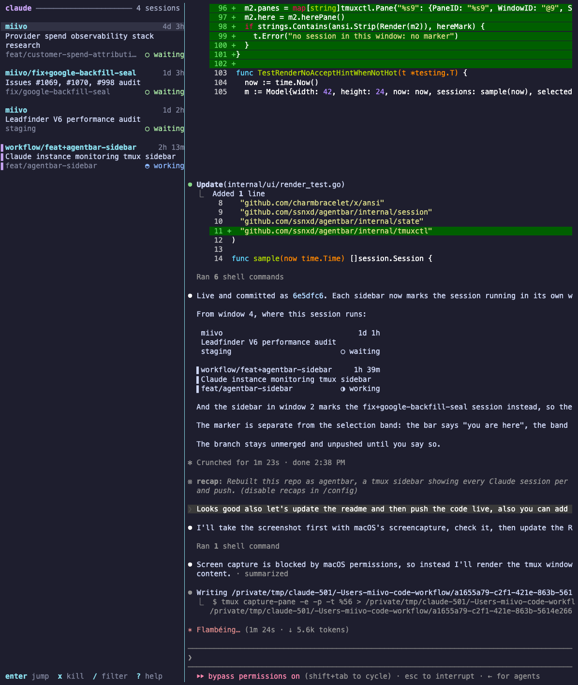

# agentbar

Your running Claude Code sessions in tmux: an indicator in the status
line, and a popup that shows what each session is doing and takes you
there.



## Install

```sh
go install github.com/ssnxd/agentbar/cmd/agentbar@latest
agentbar install
```

Add to `tmux.conf` and reload:

```tmux
run-shell "$HOME/.local/bin/agentbar tmux-init"
```

Needs tmux 3.2+ and Claude Code 2.1.26x+.

## Use

Put the indicator in your status line:

```tmux
set -g status-right '#{E:@agentbar_pill}#{session_name} '
```

- The indicator is filled when a session needs you, with the age of the
  oldest request: `● 1 needs you 12m`. It is soft while sessions work or
  wait: `◐ 2 ○ 1`. With no sessions it is gone.
- `prefix a`, or a click on the indicator, opens the session list as a
  popup in the centre: a search line, the list below it. It opens on the
  oldest request.
- In the popup, type to search; words match in any order. Arrows or
  `ctrl-n`/`ctrl-p` move, `enter` jumps, `tab` goes to the next session
  that needs you, `ctrl-y` accepts a permission prompt, `ctrl-x` kills,
  `esc` clears the search, then closes. A jump closes the popup. So does
  `ctrl-y`, once nothing else needs you.
- `prefix A` opens the same list as a sidebar in every window and
  focuses it, or takes you back. In the sidebar: `j`/`k` move, `1`-`9`
  jump to that card, `y` accept, `x` kill, `/` filter, `q` close them
  all.
- Each card: its number, repo and branch, the status with how long it has
  sat there (or the context size while working), the title, then what it
  needs you for or what it is doing right now.
- Running subagents show under their session: the task and the last tool.

After upgrading, run `agentbar install` again to add any new hooks.

Options for `tmux.conf`, set before the `tmux-init` line:

- `@agentbar-key` (popup, default `a`), `@agentbar-focus-key` (default
  `A`), `@agentbar-sidebar-key` (toggle sidebars, default none).
- `@agentbar-cap-left`, `@agentbar-cap-right`: the glyphs that end the
  indicator, to match the pills of your own status line. Without them it
  is a plain block.
- `@agentbar-accent`: the colour of the list's title and here bar, as
  `#rrggbb` or a format that gives one, such as `#{@accent}`.
- `@agentbar-side` (`left`/`right`), `@agentbar-width`.
- `@agentbar-bell`: `on` rings the bell in a session's pane when it needs
  you, so tmux flags the window.

A click opens the popup only while `MouseDown1Status` has tmux's own
binding; a binding you wrote is left alone.

To style the numbers yourself, `@agentbar_status` reads like
`5 · 2 need you` and `@agentbar_hot` is the bare count for conditionals
such as `#{?#{@agentbar_hot},#[fg=orange],}`.

Something off? `agentbar doctor`.
