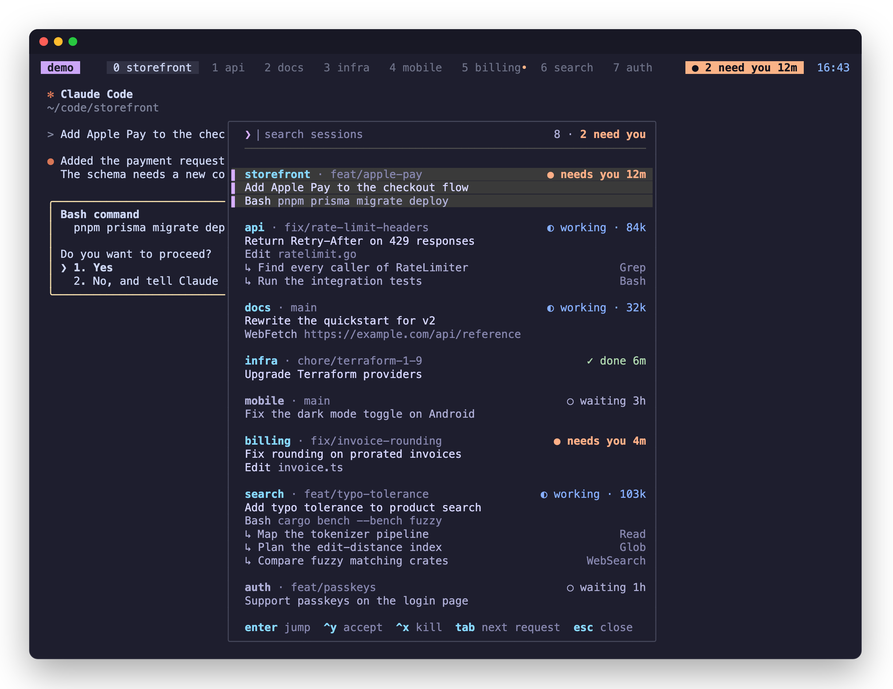
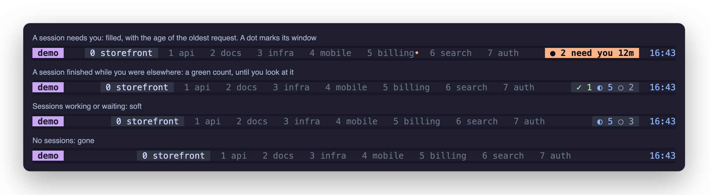

# agentbar

Plugs Claude into tmux so you know when you're needed, without getting in
your way.

agentbar watches every Claude Code session you run in tmux. One indicator
in your status line tells you when a session needs you. One key opens a
picker in the middle of the screen with every session, what it is doing,
and its subagents. Enter takes you there.



The indicator has four states:



A session that finishes while you are not looking is `✓ done`, in green,
until you look at its pane. It then drops to `○ waiting`. One that
finishes in front of you goes straight to waiting. Done never fills the
indicator: only a request does.

## Install

```sh
go install github.com/ssnxd/agentbar/cmd/agentbar@latest
agentbar install
```

Add to `tmux.conf` and reload:

```tmux
run-shell "$HOME/.local/bin/agentbar tmux-init"
```

Needs tmux 3.2+ and Claude Code 2.1.26x+.

## Use

Put the indicator in your status line:

```tmux
set -g status-right '#{E:@agentbar_pill}#{session_name} '
```

- `prefix a`, or a click on the indicator, opens the picker on the
  oldest request. Type to search; words match in any order.
- In the picker: arrows or `ctrl-n`/`ctrl-p` move, `enter` jumps, `tab`
  goes to the next session that needs you, `ctrl-y` accepts a permission
  prompt, `ctrl-x` kills, `esc` clears the search, then closes. With
  nothing asked, the picker opens on the session that has been done
  longest, and `tab` goes through the done ones.
- `prefix A` opens the same list as a sidebar instead. There: `j`/`k`
  move, `1`-`9` jump, `y` accept, `x` kill, `/` filter, `q` close.

After upgrading, run `agentbar install` again to add any new hooks.

Options for `tmux.conf`, set before the `tmux-init` line:

- `@agentbar-key` (popup, default `a`), `@agentbar-focus-key` (default
  `A`), `@agentbar-sidebar-key` (toggle sidebars, default none).
- `@agentbar-cap-left`, `@agentbar-cap-right`: the glyphs that end the
  indicator, to match the pills of your own status line. Without them it
  is a plain block.
- `@agentbar-accent`: the colour of the list's title and here bar, as
  `#rrggbb` or a format that gives one, such as `#{@accent}`.
- `@agentbar-side` (`left`/`right`), `@agentbar-width`.
- `@agentbar-bell`: `on` rings the bell in a session's pane when it needs
  you, so tmux flags the window.
- `@agentbar-notify`: `on` tells you when a session needs you or is done,
  unless its pane is on your screen. In tmux you get a sound. In another
  app you also get one desktop notification from your terminal (OSC 777:
  Ghostty, WezTerm, foot), which needs `set -g allow-passthrough on`. A
  change must hold for a second first, and several at once are one
  notification. The sounds are macOS system sounds; `@agentbar-sound off`
  keeps the notification and drops the sound.

A click opens the popup only while `MouseDown1Status` has tmux's own
binding; a binding you wrote is left alone.

To show where you are needed, agentbar sets `@agentbar_win` to `1` on each
window that holds a session needing you, and `@agentbar_sess` on each
tmux session. A dot after the window number, for example:

```tmux
setw -g window-status-format ' #I#{?@agentbar_win,#[fg=#fab387]•#[default], } '
```

To style the numbers yourself, `@agentbar_status` reads like
`5 · 2 need you` and `@agentbar_hot` is the bare count for conditionals
such as `#{?#{@agentbar_hot},#[fg=orange],}`.

Something off? `agentbar doctor`.
